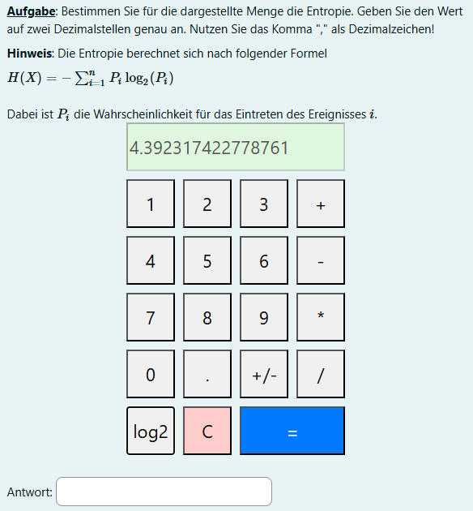

# Einfacher Taschenrechner mit log2 Funktion

Einbau des Taschenrechners über folgendes JS:

```js
<div id="calculator-container">hier</div>
<script>
    function loadCalculator() {
        // Laden der JavaScript-Datei für den Taschenrechner
        const script = document.createElement('script');
        script.src = 'https://jtuttas.github.io/log2calc/calculator.js';
        script.onload = function() {
            // Nachdem das Skript geladen wurde, wird der Taschenrechner erstellt
            createCalculator('calculator-container');
        };
        document.body.appendChild(script);

        // Laden der CSS-Datei für den Taschenrechner
        const style = document.createElement('link');
        style.rel = 'stylesheet';
        style.href = 'https://jtuttas.github.io/log2calc/calculator.css';
        document.head.appendChild(style);
    }

    // Taschenrechner wird in den Container mit der ID "calculator-container" integriert
    document.addEventListener("DOMContentLoaded", function() {
        loadCalculator();
    });
</script>

```

Sie dann z.B. in Moodle integriert wie folgt aus:

